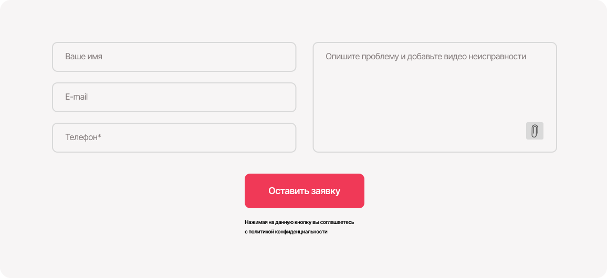
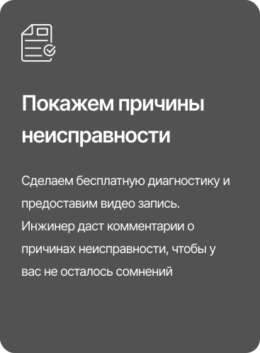

# Задание 1

```
.head
.head__eyes .head__eyes_color_blue
.head__nose .head__nose_type_medium
.head__mouth .head__mouth_size_small

.body
.body__skin .body__skin_color_white
.body__build .body__build_type_slim
.body__arms .body__arms_length_long

.legs
```

## Задание 2


```
header.header>(a.header__logo>img)+(nav.nav>ul.nav__list>(li.nav__item>a.nav__link)*4)+(a.contact-phone)
```



```
form.form>input.form__input*3+textarea.form__textarea+button.form__attach+button.form__submit+(p.form__policy>a.form__policy-link)
```



```
.card>img.card__aside+h3.card__head+p.card__text
```


```
footer.footer>(a.footer__logo>img)+ul.footer__links>(li>a.footer__link)*9
```